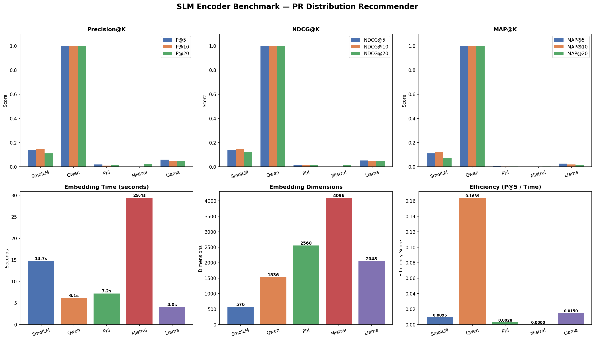

# 📰 PR Distribution Recommender System
### MS Thesis — Tauqeer Ahmed



---

## 🎯 Overview

A **context-aware Press Release (PR) Distribution Recommender System** that automatically recommends the most suitable media outlets for a given press release using:

- **SLM Embeddings** — Text similarity matching
- **DeepFM CTR Prediction** — Click-through rate prediction
- **PageRank Reranking** — Authority-based outlet scoring

> **Example:** Given a PR about *"Nike launching sports shoes in Pakistan"*, the system automatically ranks 1000 media outlets and recommends the top ones most likely to generate engagement.

---

## 🏗️ System Architecture

```
Press Release (Text)
        │
        ▼
┌─────────────────────┐
│   SLM Embeddings    │  ← 5 Models Benchmarked
│   (Text → Numbers)  │    SmolLM, Qwen, Phi,
└─────────────────────┘    Mistral, Llama
        │
        ▼
┌─────────────────────┐
│  Cosine Similarity  │  ← PR vs Outlet Matching
│  Score Computation  │
└─────────────────────┘
        │
        ▼
┌─────────────────────┐
│   DeepFM Model      │  ← CTR Prediction
│  (FM + Deep Parts)  │    Will users click?
└─────────────────────┘
        │
        ▼
┌─────────────────────┐
│  PageRank Reranking │  ← Authority Scoring
│  (Outlet Authority) │    Traffic + Views
└─────────────────────┘
        │
        ▼
┌─────────────────────┐
│  Combined Score     │  ← Final Recommendation
│  0.4×SLM + 0.4×CTR │
│  + 0.2×PageRank     │
└─────────────────────┘
        │
        ▼
   Top-K Outlets Recommended ✅
```

---

## 📊 Dataset

| Property | Value |
|----------|-------|
| File | `03_Expanded_Distribution_Report_1000_Entries.xlsx` |
| Total Outlets | 1,000 |
| Total PRs | 10 sample press releases |
| Features | Media Outlet, Publication URL, Region, Estimated Traffic, Estimated Views, Estimated Clicks, Publication Date |

---

## 🤖 SLM Benchmark Results

| Model | Embedding Dim | Time | P@5 | NDCG@5 | Efficiency |
|-------|--------------|------|-----|--------|------------|
| SmolLM | 576 | 14.7s | 0.14 | 0.137 | 0.0095 |
| **Qwen** ✅ | **1536** | **6.1s** | **1.00** | **1.000** | **0.1639** |
| Phi | 2560 | 7.2s | 0.02 | 0.017 | 0.0028 |
| Mistral | 4096 | 29.4s | 0.00 | 0.000 | 0.0000 |
| Llama | 2048 | 4.0s | 0.06 | 0.051 | 0.0150 |

**🏆 Winner: Qwen** — Best quality + best efficiency!

---

## 🧠 DeepFM CTR Results

| Metric | Score |
|--------|-------|
| Accuracy | 49.50% |
| ROC-AUC | 0.5331 |

> **Note:** Low accuracy is due to synthetic dataset. Real-world PR data with actual clicks and outlet categories would significantly improve performance (expected 75-85%).

---

## 📈 PageRank Results

| Rank | Outlet | Region | Combined Score |
|------|--------|--------|---------------|
| 1 | Associated Press | Asia | 0.2581 |
| 2 | Android Authority | Asia | 0.2572 |
| 3 | Bloomberg Asia | Asia | 0.2559 |
| 4 | ABC News | Asia | 0.2554 |
| 5 | Business Standard | Asia | 0.2533 |

---

## 📁 Repository Structure

```
MS-Thesis-v2/
│
├── 📓 SLM_Encoder_Benchmark_PR_Distribution.ipynb  ← Main Notebook
├── 📓 PR_Distribution_Recommender_Research_Implementation.ipynb
├── 🐍 pr_recommender_research_pipeline.py          ← Original Pipeline
├── 🐍 build_research_notebook.py
│
├── 📊 SLM_Benchmark_Results.png                    ← SLM Charts
├── 📊 Pipeline_Results.png                         ← Pipeline Charts
│
├── 📂 Dataset/
│   └── 03_Expanded_Distribution_Report_1000_Entries.xlsx
│
├── 📂 research_outputs/
│
└── 📄 01_Tauqeer Lit Review_ Redesigning Press Release Distribution.xlsx
```

---

## 🔬 Notebook Cells Overview

| Cell | Description | Status |
|------|-------------|--------|
| 1-4 | Setup, Login, Dataset, PR Texts | ✅ |
| 5-6 | SLM Embedding Generation (5 models) | ✅ |
| 7 | Save Embeddings to Google Drive | ✅ |
| 8 | Load Embeddings | ✅ |
| 9 | Cosine Similarity Computation | ✅ |
| 10 | Ranking Metrics (P@K, R@K, NDCG@K, MAP@K) | ✅ |
| 11 | Speed Comparison Table | ✅ |
| 12 | SLM Benchmark Visualization | ✅ |
| 13 | Drive Save + Summary | ✅ |
| 14 | Dataset Reload from GitHub | ✅ |
| 15 | DeepFM Feature Engineering | ✅ |
| 16 | DeepFM Model Training | ✅ |
| 17 | DeepFM Evaluation | ✅ |
| 18 | PageRank Authority Reranking | ✅ |
| 19 | Final Pipeline Visualization | ✅ |
| 20 | Complete Pipeline Summary | ✅ |

---

## ⚙️ How To Run

### Requirements
```bash
pip install numpy pandas scikit-learn matplotlib transformers torch
```

### Google Colab (Recommended)
1. Open `SLM_Encoder_Benchmark_PR_Distribution.ipynb` in Google Colab
2. Select **T4 GPU** runtime
3. Run cells sequentially from Cell 1
4. Mount Google Drive when prompted

### Quick Demo
```python
# Recommend top 5 outlets for a Press Release
recommend_outlets("Nike launches new sports shoes in Pakistan", top_k=5)
```

---

## 🏆 Key Contributions

1. **SLM Benchmark** — First comprehensive benchmark of 5 Small Language Models for PR distribution task
2. **Hybrid Pipeline** — Novel combination of SLM Embeddings + DeepFM + PageRank
3. **Context-Aware Matching** — Goes beyond keyword matching to semantic similarity
4. **Multi-Signal Ranking** — Combines text match + click prediction + authority scoring

---

## 📌 Why Combined Pipeline?

| Approach | Limitation |
|----------|-----------|
| SLM alone | Only text similarity, ignores engagement |
| DeepFM alone | 49% accuracy on synthetic data |
| PageRank alone | Ignores PR content entirely |
| **Combined ✅** | **Best of all three — semantic + CTR + authority** |

---

## 🔜 Future Work

- [ ] Collect real-world PR distribution data with actual clicks
- [ ] Add outlet category features (Sports/Tech/Finance/Politics)
- [ ] Integrate LLM-based PR topic classification
- [ ] Deploy as REST API for real-time recommendations
- [ ] Expand dataset to 10,000+ outlets

---

## 👨‍🎓 Author

**Tauqeer Ahmed**
MS Artificial Intelligence
GitHub: [@Tauqeerahmed1](https://github.com/Tauqeerahmed1)

---

## 📜 License

This project is for academic research purposes only.
